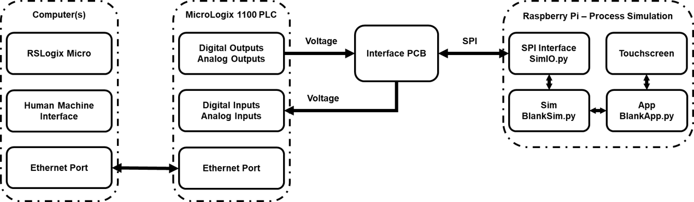

  

 
 

# HILICS - Hardware-in-the-loop industrial control system training platform

The Center for Cyberspace Research (CCR) has conducted extensive research in Industrial Control System (ICS) security. ICS architectures utilize a variety of proprietary hardware and software configurations to control and monitor industrial processes and safety systems. Defenders must be familiar with the functionality, requirements and limitations of control systems in order to successfully defend them from cyber-attacks. Hands-on training and experience is crucial for defenders who must be able to interact safely with a given control system. Without this experience, defenders could mistakenly take actions that cause more harm to the system than a basic cyber-attack.  

Given the physical nature of ICS architectures, training platforms can be difficult and costly to develop. To address this, the CCR has developed HILICS - a unique hardware-in-the-loop ICS platform designed to support training, education and research. HILICS utilizes a MicroLogix 1100 Programmable Logic Controller (PLC) to introduce students to PLC operating basics and the associated programming languages. This PLC is a low-cost commercial product that provides a representative set of features to give students exposure to control system functionality. The HILICS platform is a custom hardware-in-the-loop system that enables trainers to incorporate multiple physical process simulations and expose students to a range of control system applications. The platform is designed to be flexible and scalable, allowing for varying class sizes and supporting various control system applications.  

# How it works

HILICS is a hardware-in-the-loop training system. A Raspberry Pi provides simulations of physical processes such as fluid tanks or garage doors. Each simulation is made up of sensors, actuators and physical components such as pipes or tanks. **The Raspberry Pi does not have any network connection to the PLC.**

We will use the tank simulation as an example.

## Sensors

The Raspberry Pi simulation determines the current state of the process and calculates the values of the simulated sensors. The sensor values are sent to the PLC via the interface PCB. The PLC receives these values as voltages using it's digital and analog inputs. The PLC's ladder logic program determines how the PLC responds to the sensor values.

For the tank, there are two analog sensors and three digital sensors.

* Analog Sensors:
	* Inflow differential pressure transmitter.
	* Fluid level differential pressure transmitter.
* Digital Sensors:
	* Low level float
	* High level float
	* High-High level float
* Other:
	* This simulation was designed to work without the presence of an HMI. Typically, an HMI would be used to select set points for the process.
	* The Inflow SP button panel uses two of the PLC's digital inputs to send the desired inflow rate to the PLC.
	* The Level SP button panel uses two of the PLC's digital inputs to send the desired fluid level of the tank to the PLC.

## Actuators

The PLC reads the values of the sensors, compares them to the desired values and then adjusts it's outputs (as voltages) to control the actuators. The Raspberry Pi receives these values via the interface PCB and adjusts the simulation appropriately. 

For the tank, there are two analog actuators.

* Pump - the speed of the pump is used to calculate the current inflow rate into the tank.
* Valve - the position of the valve is used to calculate the outflow rate draining from the tank.

While the tank only has analog actuators, an example of a digital actuator is an indicator light controlled by the PLC's digital outputs.

Find further details about this simulation [here.](../labs/L3_Tank_Control.md)

# What's Included

## Documentation

The [docs](./docs) folder contains various documents including a bill-of-materials, hardware assembly and computer setup instructions.

## Source code

This repository contains all of the Python [source code](./src) you need to get started. The [apps](./src/apps) folder contains the following Applications:

* [IO_Test.py](./src/apps/IO_Test.py) - Basic app to test the functionality of the HILICS kit.
* [Door.py](./src/apps/Door.py) - Garage door simulation.
* [Fluid_Tank.py](./src/apps/Fluid_Tank.py) - Fluid tank with two control loops.
* [Blank_App.py](./src/apps/Blank_App.py) - A template to help you get started writing your own app.
* [Test_App.py](./src/apps/Test_App.py) - An app you can enable and edit to test your display elements during development.

## Hardware

The [hardware](./hardware) folder contains the design files and stl files you need to 3D print the frame for HILICS.

The [eagle](./hardware/eagle) folder contains all of the PCB design files and BOM.

## Labs

HILICS was designed for use in cyber security education, but the labs released here only cover basic PLC operations. Future labs may cover cyber concepts. 

The [labs](./labs) folder contains three basic labs to get started.

* [Lab 1](./labs/L1_Setup.md) - Get connected to your PLC and start programming in ladder logic.
* [Lab 2](./labs/L2_Door_Control.md) - Write a ladder logic program to control a garage door simulation.
* [Lab 3](./labs/L3_Tank_Control.md) - Learn the basics of PID control and PID tuning.

# Getting Started

## [Read the docs](./docs/README.md)

## [Try the labs](./labs/README.md)

## Contribute

This repository is not currently maintained and we will not be accepting any pull requests. If we develop any additional capabilities, we will release them here. If enough interest is shown, we might begin actively maintaining the repository. 

If you would like to contribute, look at the existing forks, or feel free to start your own.

# Disclaimer

Note that the views expressed in this project are those of
the authors and do not reflect the official policy or position of
the U.S. Air Force, U.S. Department of Defense or the U.S.
Government.

Approved for public release, 24 Sep 2019, Case #88ABW-2019-4607.

