

  

 
 

This guide will walk you through the steps to assemble your HILICS training platform.

# Components

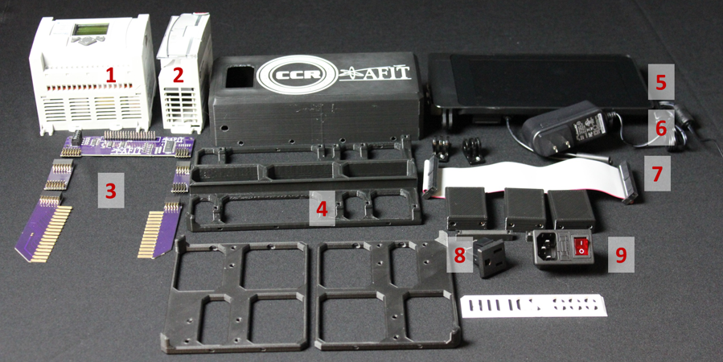

You will need the following components to assemble your HILICS kit. Further details and the BOM can be found [here.](./README.md)

1. 1763-L16BWA
1. 1762-OF4
1. [HILICS PCBs](../hardware/eagle/ML1100_Pi_Interface)
1. 3D Printed Parts:
	* [HILICS_Power_single_ext.stl](../hardware/cad/stl_files)
	* [1x_HILICS_PLC_Frm.stl](../hardware/cad/stl_files)
	* [2x_HILICS_Pi_Frm.stl](../hardware/cad/stl_files)
	* [3x_HILICS_ExtBlck.stl](../hardware/cad/stl_files)
	* [2x_PCB_Leg.stl](../hardware/cad/stl_files)
	* [HILICS nameplate](../hardware/cad/Nameplates/stl_files)
1. Raspberry Pi, touchscreen, case, SD card and hinges
1. Raspberry Pi power supply (5 VDC - 2.5 amp)
1. Raspberry Pi ribbon cable (40 pin)
1. Panel-mount power socket with fuse and switch
1. 110 VAC panel mount outlet

Additional components:

1. M3x8mm countersunk bolts.
1. M3x12mm countersunk bolts.
1. M3x10mm pan head bolts (longer will also work).
1. M3 nuts.
1. M4x8mm pan head bolts (longer will also work).
1. 22 AWG stranded wire.
1. 18 AWG stranded wire.

# Part 1 - Raspberry Pi half

* Assemble the Raspberry Pi, touchscreen and touchscreen case using the directions that came with them. Leave the screen protector in place to protect it during the rest of the assembly.

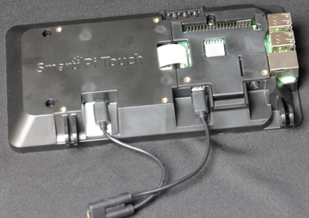

* Connect the two Raspberry Pi frame halves (2x_HILICS_Pi_Frm.stl) together using four M3x8mm countersunk bolts. Note the orientation of the vertical tabs.

	**WARNING: Do not over-tighten the bolts or you will strip the plastic.**

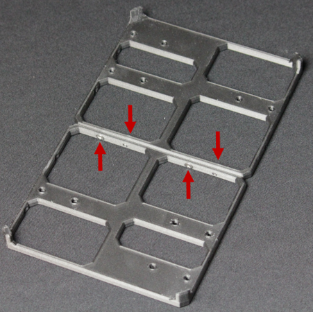

* Place four M3 nuts in each of the two hinge mounts (3x_HILICS_ExtBlck.stl). 
* Place two M3 nuts in the support block (3x_HILICS_ExtBlck.stl).
* Use four M3x12mm countersunk bolts to attach the two hinge mounts to the outside positions on one side of the frame.
* Use two M3x12mm countersunk bolts to attach the support block to the middle position on the other side of the frame. This block is simply to support the Raspberry Pi Touchscreen when the kit is closed. The top two holes are not used.
* Attach the case hinges to the hinge mounts (3x_HILICS_ExtBlck.stl).

* Attach the Raspberry Pi to the hinges. 

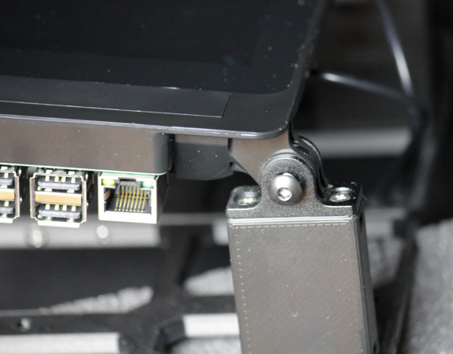

* Set this half of the kit to the side for later.

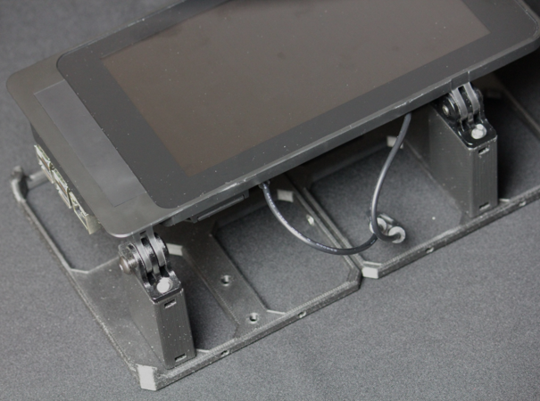

# Part 2 - PLC half

* Attach the ML1100 to the DIN rail on the PLC frame (1x_HILICS_PLC_Frm.stl) and position the PLC so that the mounting points line up as shown.
* Place two M3 nuts in each PCB standoff and attach them to the base using M3x12mm countersunk bolts.

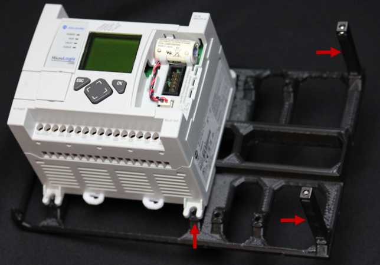

* Attach the expansion module to the DIN rail. Plug the ribbon cable in to the MicroLogix 1100 and push the two together. 

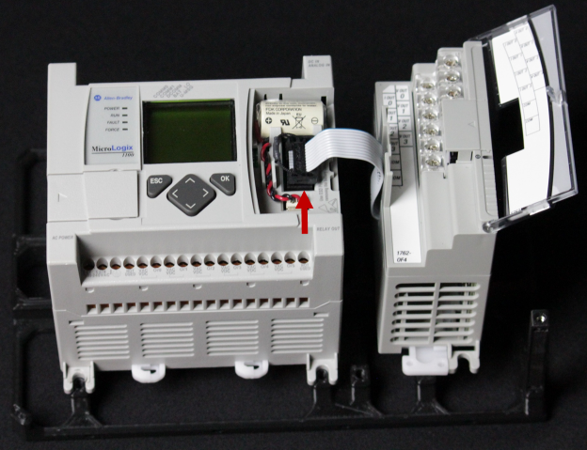

* Secure the PLC and Expansion module in place using one M4x8mm screw in each. You can use more than one screw each if you like to be paranoid.

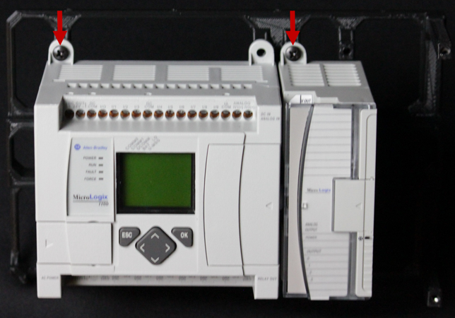

* Slide the comb-shaped PCBs into the sides of the ML1100 and tighten ALL of the screw terminals on the PLC.
**NOTE: The three 100-240 VAC terminals should be empty at this point.**

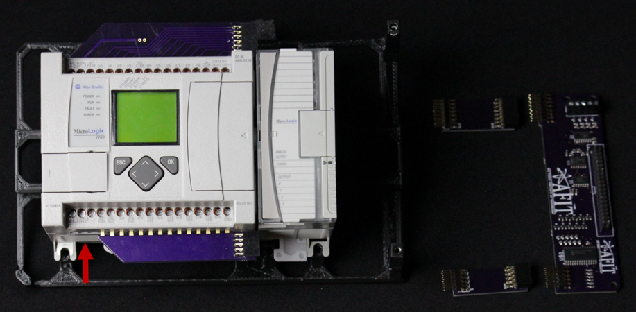

* Attach the two PCB extenders to the comb-shaped PCBs.
* Attach the main board to the PCB extenders. 
* Secure the main board to the PCB legs using two M3x10mm pan head bolts.

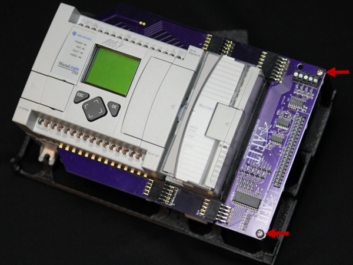

* Wire the analog output module's **VOUT** terminals to the screw terminals on the main board as shown. We recommend using 22 AWG stranded wire. 
* **Pay attention to the labels on the PCB and expansion module.**
* **The IOUT (lower level) terminals on the expansion module should not be connected.**

* Attach the two power connectors to the power box (HILICS_Power_single_ext.stl).
* Attach the power box to the MicroLogix frame using 4 M3x8mm countersunk bolts.

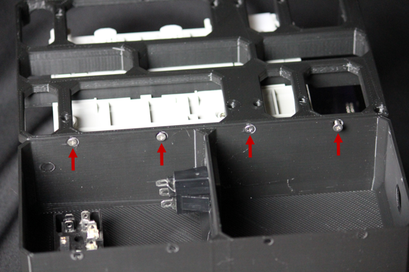

**WARNING: do not work on the system while power is connected. It's not my fault if you electrocute yourself.**

* Wire the power connectors using 18 AWG stranded wire and crimp-on spade connectors. Make sure the spade connectors are crimped correctly.
* Plug the Raspberry Pi power supply into the 110 VAC outlet inside the power box. 

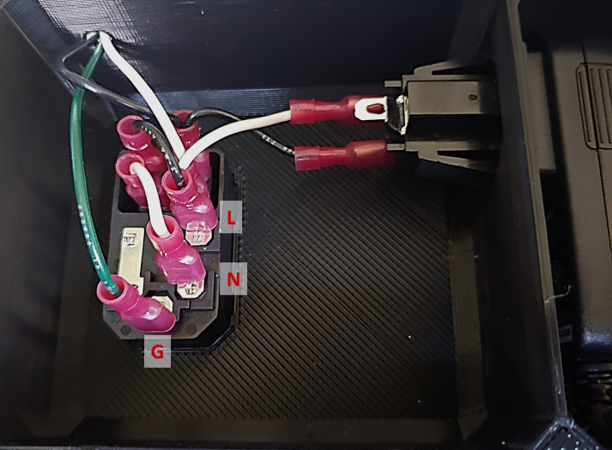
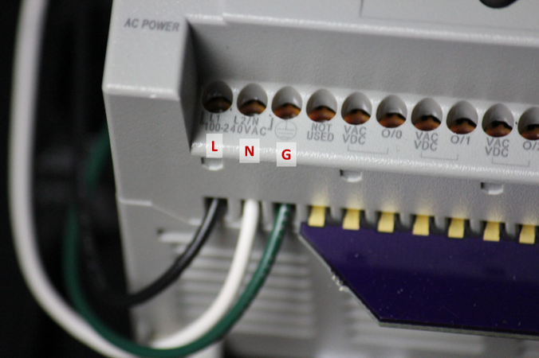

# Part 3 - Assemble the halves

* Connect the two halves together using four M3x8mm countersunk bolts.
 
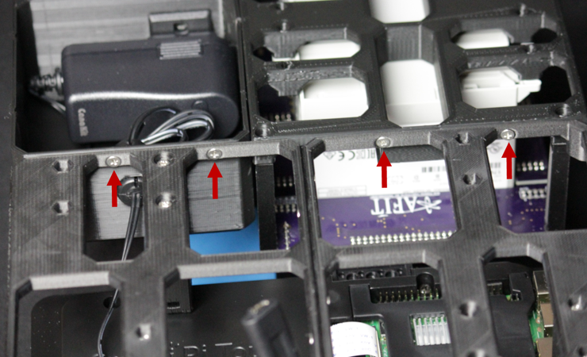

* Feed the end of the Raspberry Pi power cable through the hole in the power box.

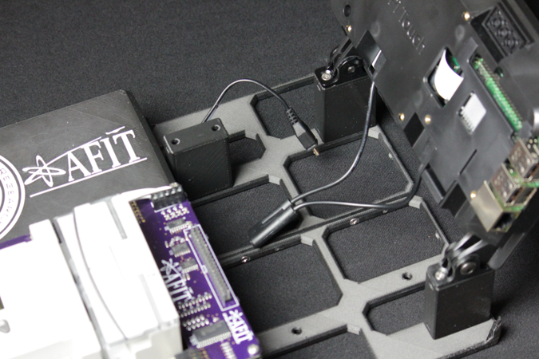

* Plug the Raspberry Pi power cable into the Raspberry Pi USB splitter.
* Connect the Raspberry Pi to the main PCB using the 40-pin ribbon cable.
 **Note: The arrows denote the orientation of the ribbon cable connector tabs.**

* Your kit is assembled! All that's needed now is to put it in the Pelican 1450 case.

# Part 4 - Pelican 1450

* Remove the "Pick N'Pluck" foam from the Pelican 1450 case. 
* Separate the outer ring of foam from the inside. Throw the inside foam away (or save it for packing material).

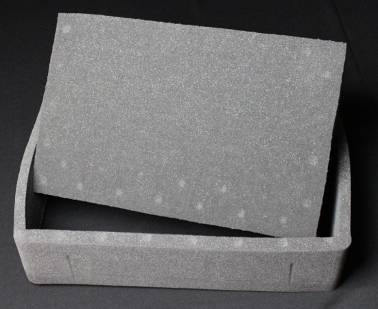

* Place the ring of foam in the case. You should now have the bottom foam, top foam and the outer ring.

	Note: Some of the Pelican cases we received had a narrower ring than others, causing the kit to be loose. If this happens, leave one row of Pick N'Pluck foam attached to the outer ring to get a tighter fit.

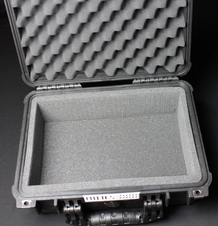

* Remove the plaque from the front of the Pelican case. Replace it with the HILICS nameplate.

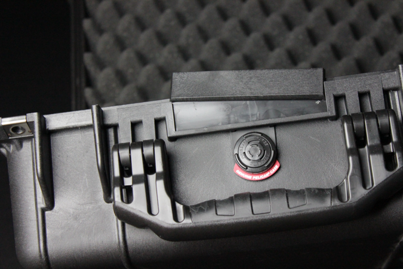

* Slide the assembled HILICS kit into the Pelican case.

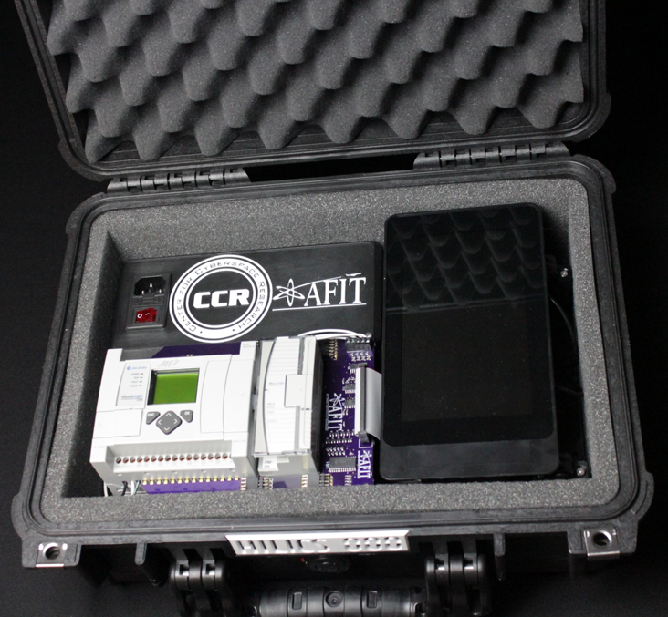

Congratulations, your ready to move on to the next step!

   

Previous: [Raspberry Pi setup](./RPi_Setup.md)

Return: [Build a kit](./README.md)

Next: [Install Rockwell Tools](./Rockwell_Tools.md)