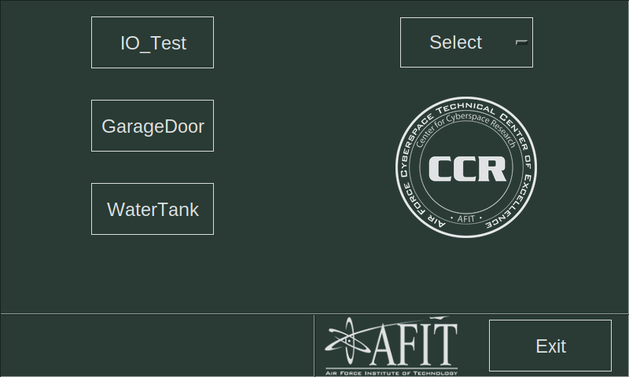
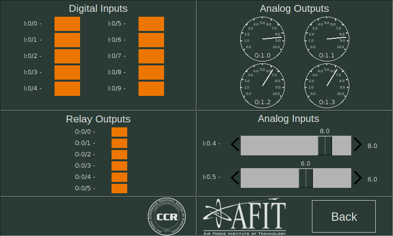
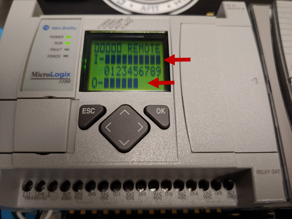
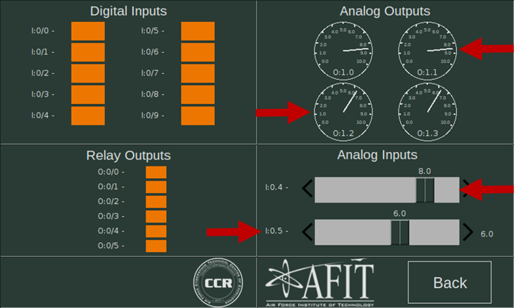
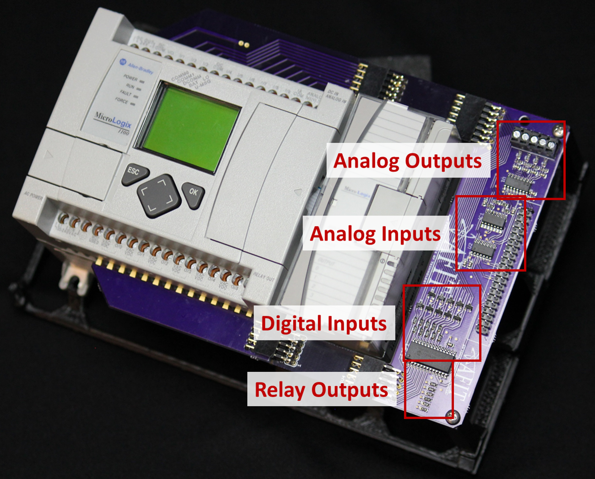

  

 
 

# Hardware test

This guide will walk you through the test to make sure your HILICS training platform is functioning properly. 

## 1. Download IO_Test.RSS to PLC

Follow the instructions from [the previous step](./RSLogix_Net_Config.md) to load [IO_Test.RSS](../labs/LadderLogic_Examples/) and download it to the PLC.

## 2. Open the IO_Test app on the Raspberry Pi

This application is used to test the inputs and outputs of the PLC and the HILICS PCB. The IO_Test.RSS ladder logic copies the state of the Digital Inputs to the Relay Outputs. It also copies the value from the Analog Inputs to the Analog Outputs.

## 3. Test the digital inputs and outputs.

Use the touchscreen to activate all ten of the Digital Inputs. The PLC's ladder logic should activate all of the Relay Outputs.

Look at the display on the front of the PLC. If everything is working, all of the blocks next to "I" and "O" should be filled in, indicating that all inputs and outputs are activated.

## 4. Test the analog inputs and outputs.

Use the touchscreen to slide the Analog Inputs slider up and down. The PLC's ladder logic should copy the value of Analog Input 1 (I:0/4) to both Analog Outputs 0 and 1 (O:1.0 and O:1.1). It should also copy the value of Analog Input 2 (I:0/5) to both Analog Outputs 2 and 3 (O:1.2 and O:1.3).

If any of the values are incorrect, use RSLogix Micro to check the value of the Analog Inputs.

# Troubleshooting

If any of the inputs or outputs do not pass the tests, it is most likely an issue with the HILICS PCB (especially if you hand-soldered them). Follow these steps to correct the issue.

1. Always troubleshoot PLC inputs before PLC outputs.
1. Make sure the Raspberry Pi ribbon cable is plugged in securely.
1. Make sure the PLC screw terminals are all tightened down.
1. Make sure all PCB components are soldered correctly and check for cold solder joints and short circuits.
1. Make sure resistors for the analog components are the correct values (10K for Analog Outputs and 100K for Analog Inputs).

   

Previous: [Configure RSLogix project](./RSLogix_Net_Config.md)

Return: [Build a kit](./README.md)
