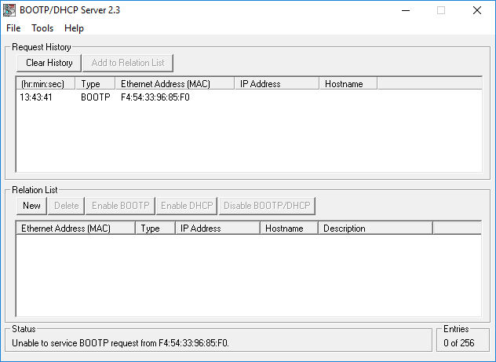
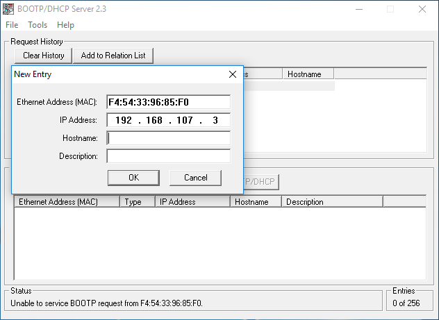
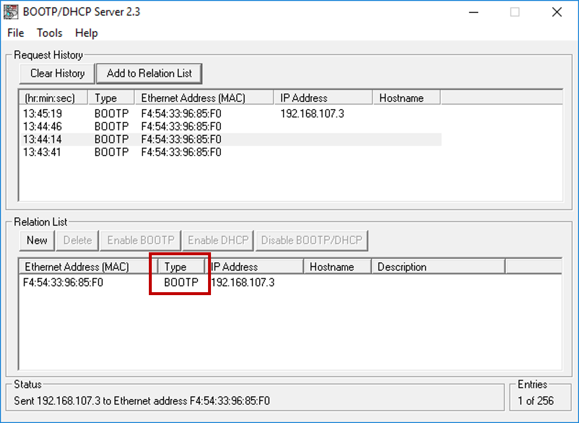
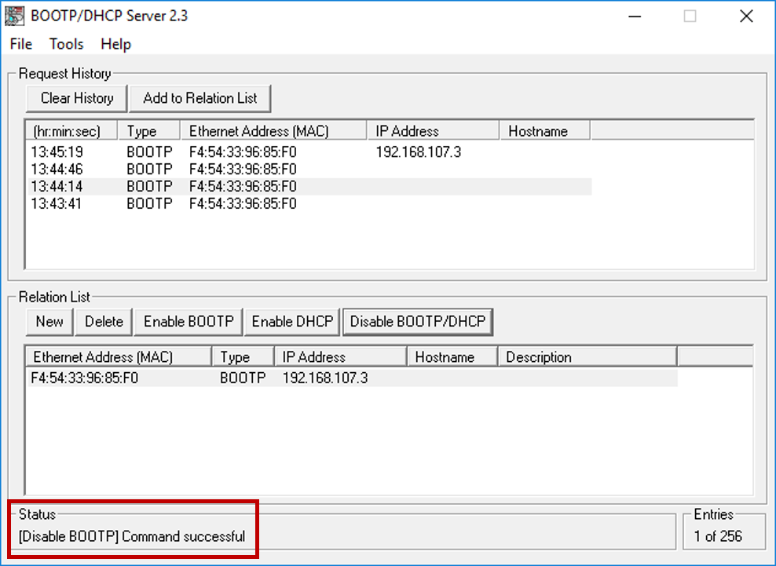

  

 
 

# How to assign an IP address to your PLC

**NOTE: Many of the labs and example ladder logic applications assume that the IP address of the PLC is 192.168.107.3. We recommend you use this IP if possible.**

1. Launch "BOOTP-DHCP Server"

2. Wait for your PLC's MAC address to show up with BOOTP listed under "Type".

	* If the PLC doesn't show up after a minute, use the buttons on the PLC to see if it already has an IP address. 
	* If it does not have an IP address, double-check your ethernet connections.

3. Select your PLC in the "Recent History" list and click "Add to Relation List".

4. Enter your desired IP address and click "OK".

5. Your PLC's MAC address and IP address will now show up under "Relation List". 

	**Initially, the "Type" field will be blank - this means that the IP address has not yet been assigned to the PLC. You must wait until "BOOTP" is listed under "Type" as shown below. This indicates that the PLC's IP address has been assigned.**

6. At this point, the PLC has an IP address, but is still configured to use BOOTP when booting up. If you power-cycle the PLC, it will lose it's IP address and you will need to repeat this process.

7. Make sure your computer's IP address is in the same subnet as the PLC. **You should be able to ping the PLC at this point.**

8. To disable BOOTP and make the IP address permanent, select your PLC under "Relation List" and click "Disable BOOTP/DHCP". If this command works, you will see "[Disable BOOTP] Command Successful" under "Status" at the bottom of the window.

9. It is now safe to close BOOP/DHCP Server and power-cycle the PLC.

   

Previous: [Install Rockwell Tools](./Rockwell_Tools.md)

Return: [Build a kit](./README.md)

Next: [Configure RSLinx](./RSLinx_Config.md)

