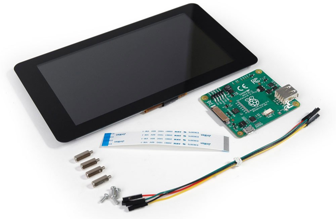
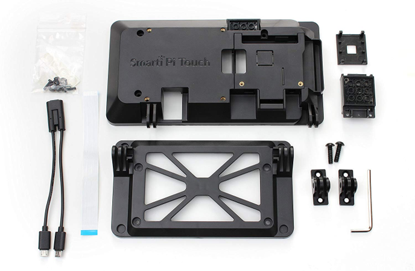
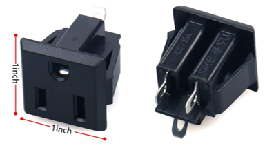
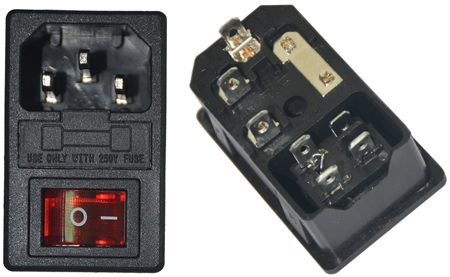

  

 
 

This guide will walk you through the steps to build your own HILICS training platform.

**WARNING: Building a HILICS kit is not for the faint-of-heart. Each HILICS kit costs roughly 1,000 USD to make (not counting labor), but your costs will vary. You will need to 3D print the frame, fabricate and solder the PCBs, wire 110 VAC power to the PLC, and setup a Raspberry Pi running Rasbian.**

# Components - BOM

## MicroLogix 1100 PLC
HILICS is designed to work with the MicroLogix 1100 PLC. The specific model number for the PLC and the Analog Output module are listed below. 

**NOTE: HILICS does not currently support any other PLC or PLC configuration. Other versions of the MicroLogix 1100 may work, but modifications will be needed.**

* 1763-L16BWA - MicroLogix 1100 with:
	* 9 digital inputs
	* 6 relay outputs
	* 2 analog inputs
	* 110 VAC power input

* 1762-OF4    - Module with 4 analog outputs

## [Raspberry Pi](https://www.raspberrypi.org/)

HILICS is designed around the Raspberry Pi for running process simulations.

For each HILICS kit, you will need the following Raspberry Pi components:

* Raspberry Pi from the list below.
* Official Raspberry Pi 7" touch screen display.

* SmartiPi case for the official Raspberry Pi 7" touch screen Display.

* 40-pin (2 row) male header (for main HILICS PCB).
* The following components may come as part of a Raspberry Pi kit (e.g., CanaKit)
	* 40-pin GPIO ribbon cable for Raspberry Pi.
	* Micro SD card.
	* Raspberry Pi power supply (5V 2.5A).
	* Optional, but recommended - Raspberry Pi heatsinks

Tested:
* Raspberry Pi 3 B 
* Raspberry Pi 3 B+

Untested, but should work:
* Raspberry Pi 4

Not recommended
* Raspberry Pi 2 or prior
* Raspberry Pi Zero or similar

## [Pelican 1450](https://www.pelican.com/us/en/product/cases/protector/1450)

The HILICS frame was designed to fit inside a Pelican 1450 case with the "Pick N'Pluck" foam removed.

Other cases may work (with modifications), but we recommend you look at the dimensions in the Fusion 360 files before purchasing a case.

## Power connectors

These are generic parts that are cheap and readily available. Purchase one to verify it will fit in the 3D printed power box. If the power box is too tight, you may need to use a knife to trim away some plastic.

Each HILICS kit requires:
* One 110 VAC panel mount outlet
* One panel-mount power socket with fuse and switch

## Other components

* M3x8mm countersunk bolts/screws.
* M3x12mm countersunk bolts/screws.
* M3x10mm pan head bolts/screws (longer will also work).
* M3 nuts.
* M4x8mm pan head bolts/screws (longer will also work).
* 22 AWG stranded wire.
* 18 AWG stranded wire.
* Spade connectors, strippers and crimpers

## [Interface PCBs](../hardware/eagle/ML1100_Pi_Interface)

For each HILICS kit, you will need one each of the five [Interface PCBs](../hardware/eagle/ML1100_Pi_Interface). The BOM is in the folder with the eagle files. The BOM is for Digikey but provides part numbers if you want to source components from a different supplier.

**You will also need 40-pin male headers for the Raspberry Pi ribbon cable to connect to the main PCB. These are cheaper on Amazon.**

If you plan to solder these by hand, make sure you are competent with surface mount soldering techniques. It may also be helpful to modify the main PCB design to use resistor arrays instead of individual resistors. Similar modifications can help reduce the amount of soldering required.

## [3D printing](../hardware/cad)

The frame was designed in sections so that the largest part (135mm x 210mm) would still fit on a smaller 3D printer. We printed all of our components using black PLA without any supports. 
The amount of time and filament it will take depends heavily on your 3D printer settings.

 Our settings:

* 0.4mm layer height (0.2mm first layer height)
* 0.6mm nozzle
* 2 perimeters
* 3 bottom layers
* 3 top layers
* 20% infill

You will need to 3D print the following stl files (quantities listed):

* 1x - PLC Frame - 1x_HILICS_PLC_Frm.stl
* 2x - Raspberry PI Frame - 2x_HILICS_Pi_Frm.stl
* 2x - PCB legs - 2x_PCB_Leg.stl
* 3x - Extension Blocks - 3x_HILICS_ExtBlck.stl
* 1x - Choice of power box:
	* Multi-color: HILICS_Power_Color_* are individual stl files for multi-extruder/multi-color printers.
	* Single-color: HILICS_Power_single_ext.stl is for single extruder/color printers.

If you need to make modifications to the design, the Fusion 360 design files are [here.](../hardware/cad/Fusion360)

## [Nameplates](../hardware/cad/Nameplates)
You may also want to print [nameplates](../hardware/cad/Nameplates) for the front of your Pelican cases to uniquely identify each HILICS kit. We printed ours in white PLA

# Assembly

## [Raspberry Pi setup](./RPi_Setup.md)

## [Hardware assembly](Hardware_Assembly.md)

## PLC setup

1. [Install Rockwell Tools](./Rockwell_Tools.md)
1. [Configure PLC network settings](./PLC_Net_Config.md)
1. [Configure RSLinx](./RSLinx_Config.md)
1. [Configure RSLogix project](./RSLogix_Net_Config.md)

## [Hardware test](./Hardware_Test.md)

