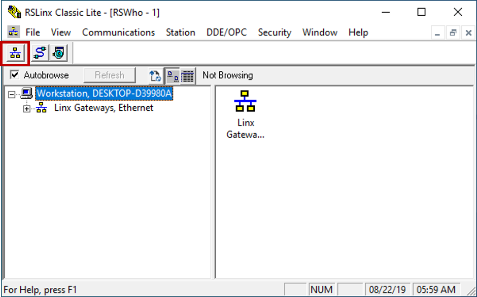
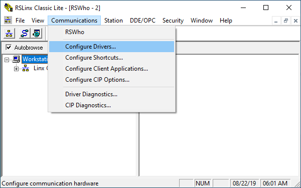
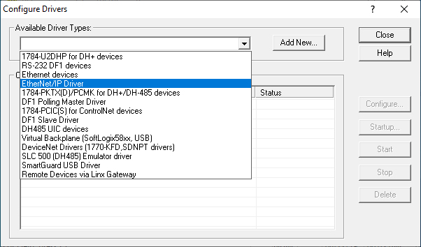
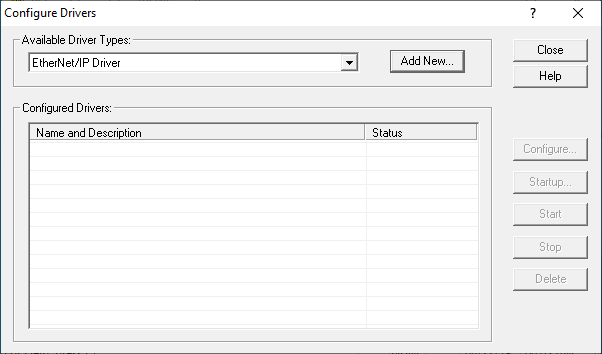
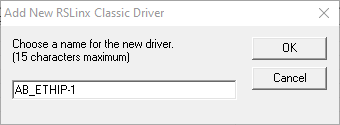
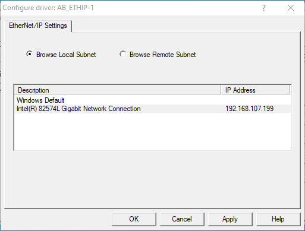
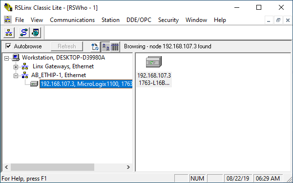

  

 
 

# RSLinx setup 

RSLinx is a utility that facilitates communication between RSLogix Micro and Rockwell PLCs. In order for RSLogix to talk to the PLC, RSLinx must first be configured.

**Before you begin this guide, make sure that [RSLinx is installed](./Rockwell_Tools.md) and that you can ping the MicroLogix 1100.**

1. Open RSLinx and click the RSWho icon.

2. Click "Communications >> Configure Drivers..."

3. In the Configure Drivers window, select "EtherNet/IP Driver" from the dropdown menu.

4. Click "Add New".

5. You can rename the driver if you like, but the default name is fine. Click "OK".

6. In the new window, choose "Browse Local Subnet" and select the network interface that is connected to the PLC or the PLC network. 

	Click "OK".

7. If all goes well, RSLinx should automatically find your PLC and add it to the device list under the driver. This process may take some time depending on your subnet configuration.

	Note: As long as this window is open, RSLinx will browse your subnet looking for new PLCs.

   

Previous: [Configure PLC network settings](./PLC_Net_Config.md)

Return: [Build a kit](./README.md)

Next: [Configure RSLogix project](./RSLogix_Net_Config.md)
