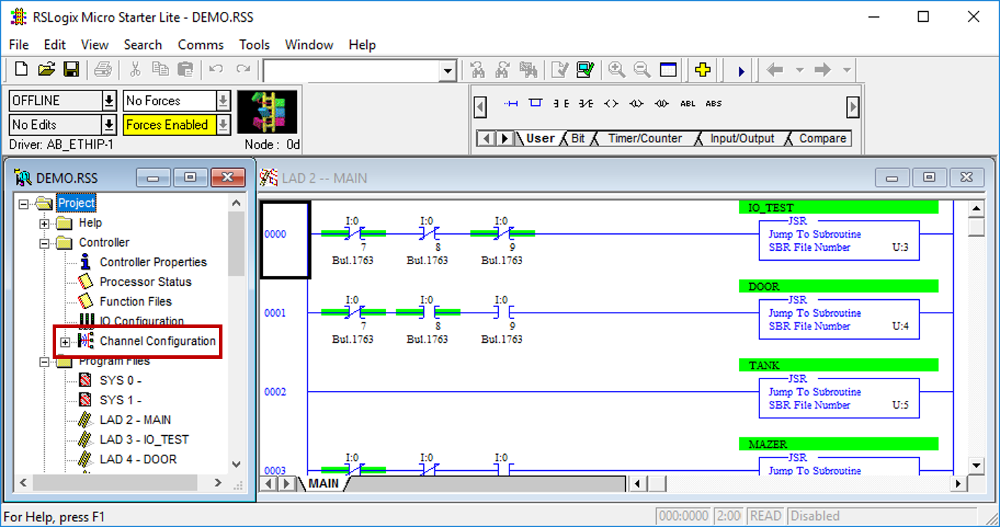
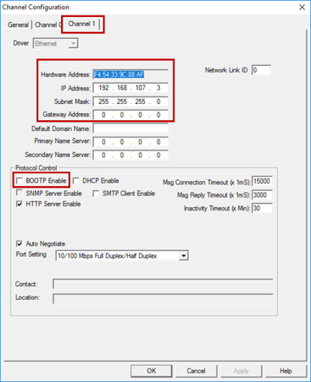
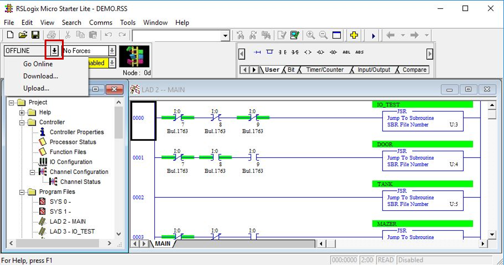
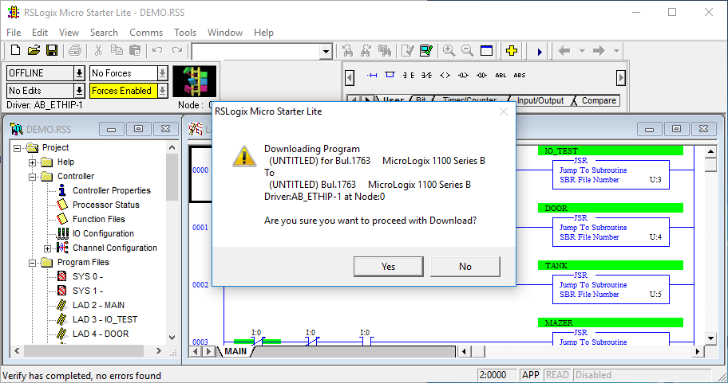
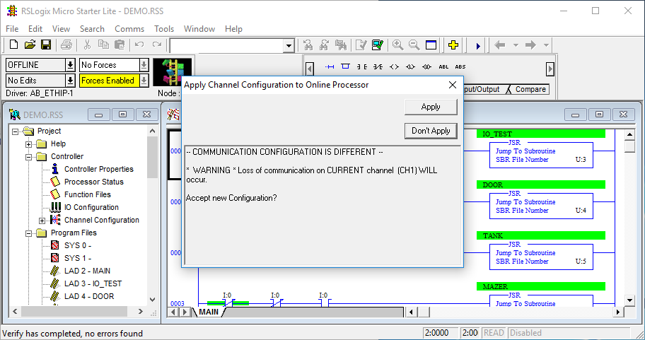
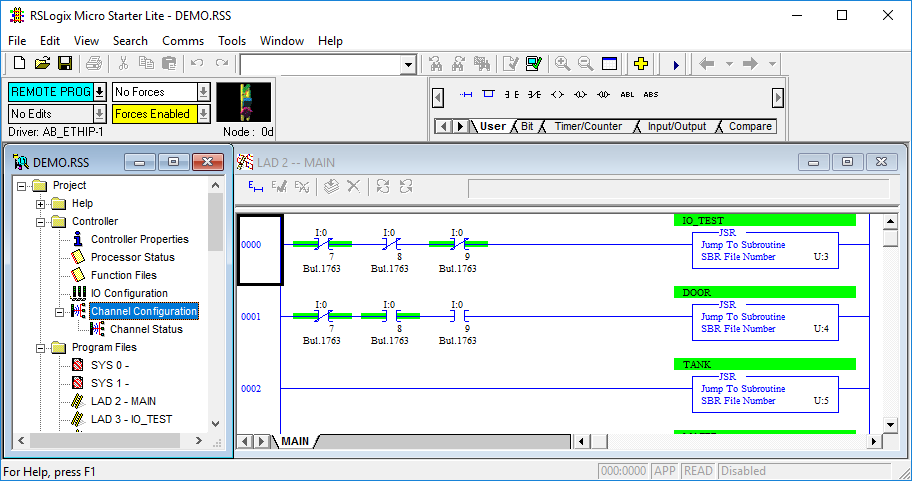
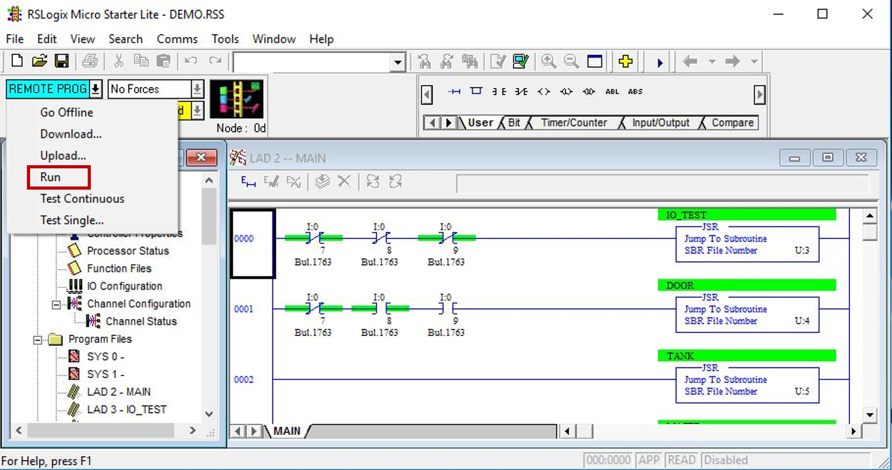
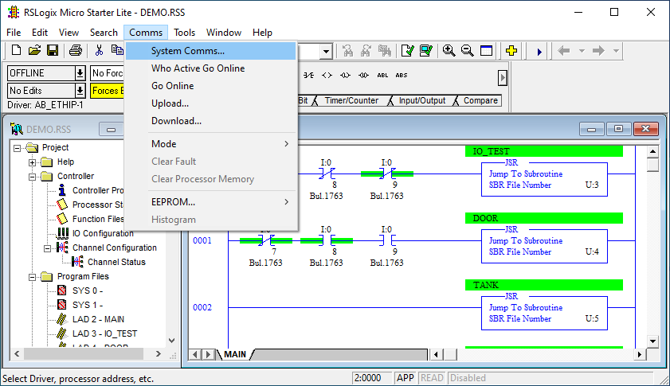
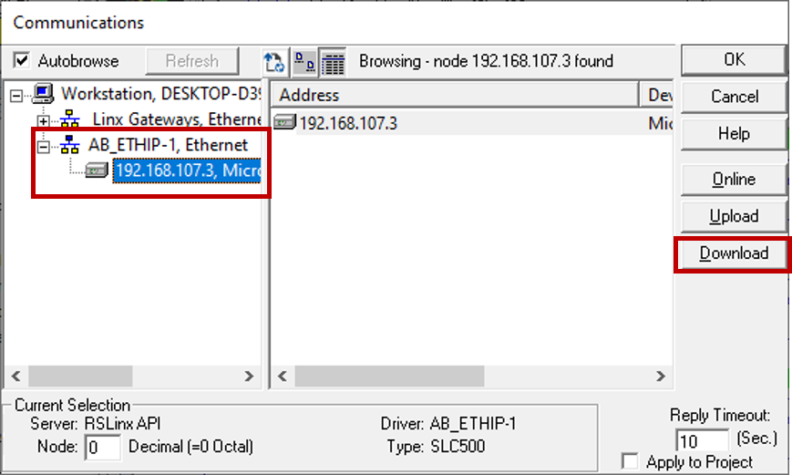

  

 
 

# IP address setting in RSLogix

In RSLogix Micro Starter Lite, each project has it's own network configuration. During a Download, if the network configuration in the project doesn't match the PLC's configuration, RSLogix will prompt you to "Apply" or "Don't Apply" the project's settings. By default, BOOTP is enabled in the project configuration; you will need to change this so that your PLC's IP address doesn't get wiped out each time you do a Download.

Note: you can also use this method to change the PLC's IP address.

1. Open [DEMO.RSS](../labs/LadderLogic_Examples/) (or other project file) in RSLogix.

2. In the tree on the left, double-click "Channel Configuration".

3. In the new window, select Channel 1 tab.

4. Fill out the highlighted fields to match your desired settings. **Remember to deselect "BOOTP Enable".** Click "OK" to close this window.

5. Click the arrow next to "OFFLINE" and click "Download".

6. If all goes well, you should see the following window. Click "Yes" to continue. 

	**If RSLogix/RSLinx fails to find the PLC, try step 10 below.**

7. If the project network settings don't match the PLC's settings, you will see this window. To apply the project settings to the PLC, click "Apply". 

	**If you are not sure that your project settings are correct, click "Don't Apply"**

8. Once the settings are applied, you may need to repeat the Download (Steps 5 and 6 above). If the Download completes successfully, you should see "REMOTE PROG" or "REMOTE RUN".

9. If it's in "REMOTE PROG", click the arrow again and select "Run". This will put the PLC in run mode and your Ladder Logic will begin executing.

## **If steps 5 & 6 above don't work:**

10. Select "Comms >> System Comms".

11. In the "Communications" window, expand AB_ETHIP-1 driver and select your PLC from the list.

	Click "Download" on the right.

	Go back to Step 6 to continue.

   

Previous: [Configure RSLinx](./RSLinx_Config.md)

Return: [Build a kit](./README.md)

Next: [Hardware test](./Hardware_Test.md)
