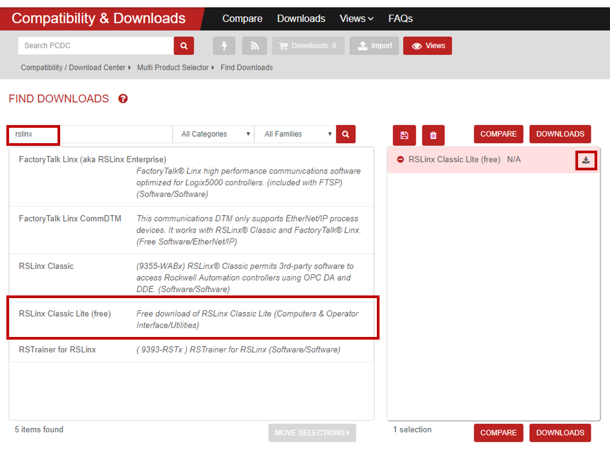
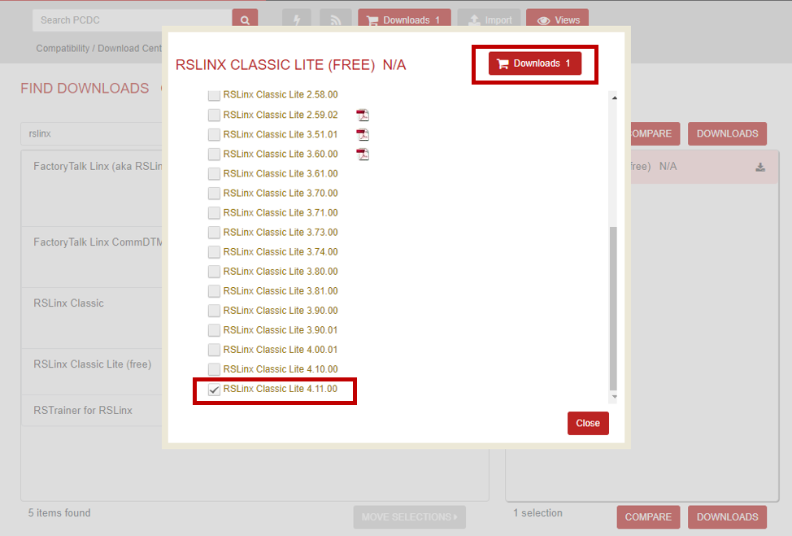
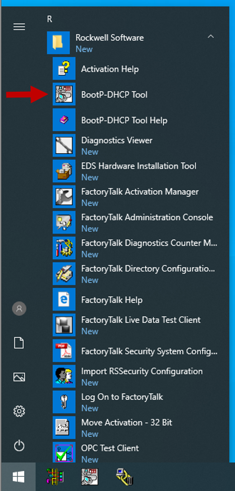
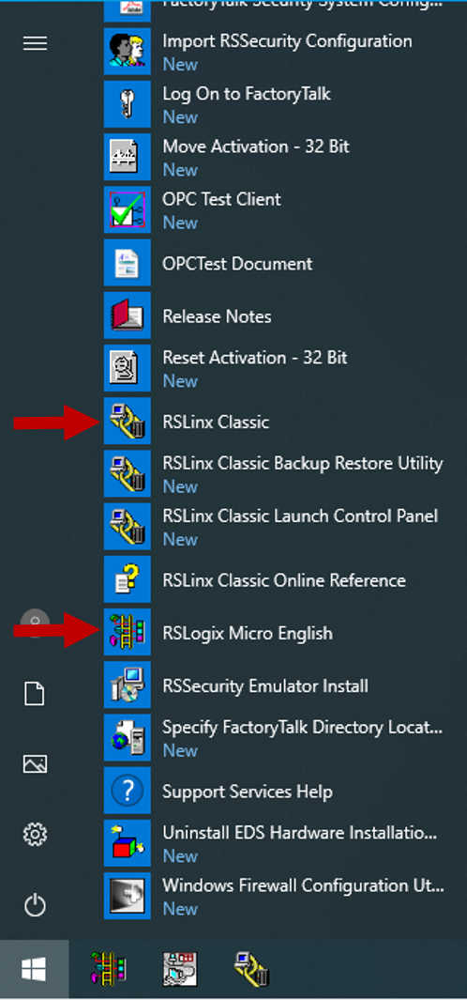

  

 
 

# RSLogix Micro Starter Lite download

HILICS is designed to support the MicroLogix 1100 PLC. The programming software for this PLC (RSLogix Micro Starter Lite) is free! Follow this brief guide to get the software ready for your MicroLogix 1100.

1. To download software from Rockwell, you will need to create a free account. 

2. Follow [this guide to download RSLogix Micro Starter Lite](https://rockwellautomation.custhelp.com/app/answers/details/a_id/63956/~/where-can-i-find-rslogix-micro-starter-lite-software%3F).

# RSLinx download

1. While you are on the "Compatibility & Downloads" page, search for "RSLinx". Select the free version and click the download button on the right. 

2. Select the latest version and click "Downloads". Follow the prompts to download the installer for RSLinx.

# Install

1. Install both RSLogix and RSLinx on a Windows computer (XP, Win 7 or Win 10). I recommend creating a virtual machine for this. 

	You will need to run the downloaded executables and extract any ZIP files. Eventually you should find a "setup.exe" file for each program. Run these two files to install the tools.

	The installation process is pretty straight forward and you can keep all the default settings for the installers.

2. At this point you should see a "Rockwell Software" folder in your start menu. Three of these applications are needed to move forward:

	* BootP-DHCP Tool
	* RSLinx Classic
	* RSLogix Micro

 

   

Previous: [Hardware assembly](./Hardware_Assembly.md)

Return: [Build a kit](./README.md)

Next: [Configure PLC network settings](./PLC_Net_Config.md)