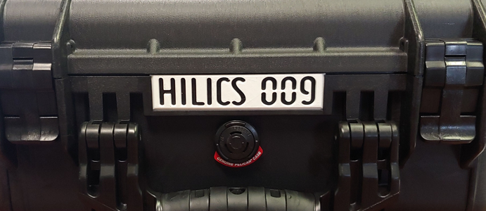

  

 
 

# Custom Hardware

## [Interface PCBs](./eagle/ML1100_Pi_Interface)

For each HILICS kit, you will need one each of the five [Interface PCBs](./eagle/ML1100_Pi_Interface). The bill of materials is in the folder with the PCBs. The BOM is for Digikey but provides specifications if you want to source components from a different supplier.

**You will also need 40-pin male headers for the Raspberry Pi ribbon cable to connect to the main PCB. These are cheaper on Amazon.**

If you plan to solder these by hand, make sure you are competent with surface mount soldering techniques. It may also be helpful to modify the main PCB design to use resistor arrays instead of individual resistors. Similar modifications can help reduce the amount of soldering required.

## [3D printing](./cad/stl_files)

The frame was designed in sections so that the largest part (135mm x 210mm) would still fit on a smaller 3D printer. 
We printed all of our components using black PLA without any supports. 
The amount of time and filament it will take depends heavily on your 3D printer settings.

 Our settings:

* 0.4mm layer height (0.2mm first layer height)
* 0.6mm nozzle
* 2 perimeters
* 3 bottom layers
* 3 top layers
* 20% infill

You will need to 3D print the following stl files (quantities listed):

* 1x - PLC Frame - 1x_HILICS_PLC_Frm.stl
* 2x - Raspberry PI Frame - 2x_HILICS_Pi_Frm.stl
* 2x - PCB legs - 2x_PCB_Leg.stl
* 3x - Extension Blocks - 3x_HILICS_ExtBlck.stl
* 1x - Choice of power box:
	* Multi-color: HILICS_Power_Color_* are individual stl files for multi-extruder/multi-color printers.
	* Single-color: HILICS_Power_single_ext.stl is for single extruder/color printers.

If you need to make modifications to the design, the Fusion 360 design files are [here.](./cad/Fusion360)

## [Nameplates](./cad/Nameplates)

You may also want to print [nameplates](./cad/Nameplates) for the front of your Pelican cases to uniquely identify each HILICS kit. We printed ours in white PLA

