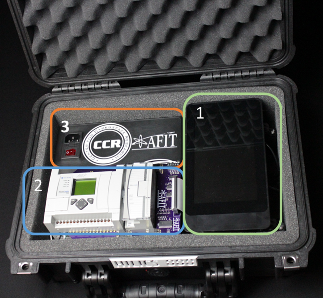
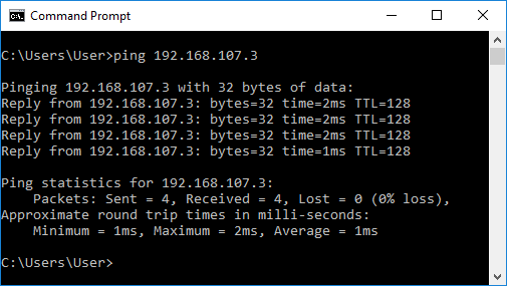
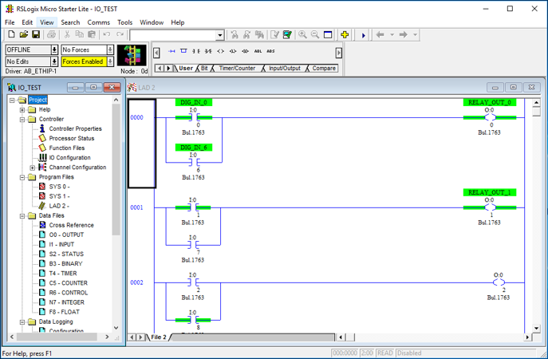
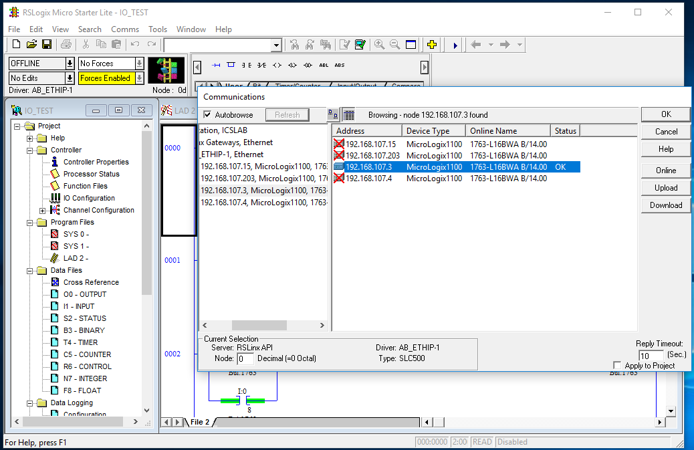
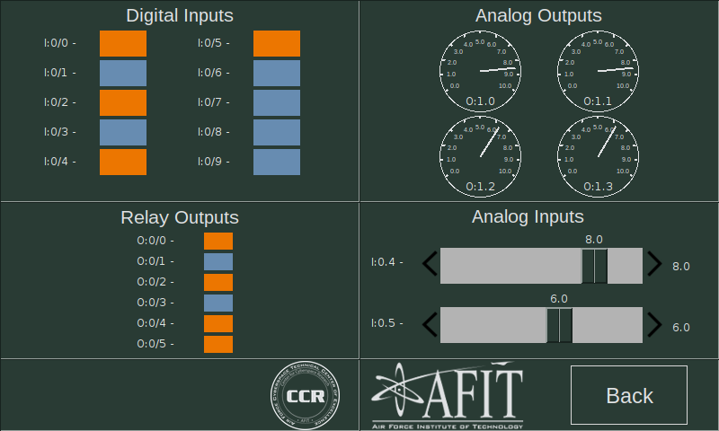

  

 
 

# Lab 1 - Setup and Familiarization

# Intro
In this lab you will setup your HILICS training platform. This process includes understanding how to connect to the kit, program the PLC, and test the hardware using the [IO_Test.RSS](./LadderLogic_Examples/) example project.

# HILICS Contents

**WARNING! Do not remove the system from the Pelican case while power is connected.**

1. Raspberry PI touchscreen - process simulator.
2. MicroLogix 1100 - Programmable Logic Controller.
3. Power connector and switch.

# Procedure

1. Open your HILICS case and plug in the power.

2. Use an Ethernet cable to connect the **PLC** to your **computer.**

	**NOTE: do not connect anything to the Raspberry Pi.**

3. If necessary, follow the PLC Setup instructions [here.](../docs/README.md#PLC-setup)

4. At this point you should be able to ping the PLC. 

5. Start RSLogix Micro and open Desktop\Projects\IO_Test.

6. Open the Comms >> System Comms menu.
7. Select the IP of your PLC.
8. Download the program, clicking through the numerous, pointless and annoying pop ups.
	
	Note: In this program, “download” means write the program to the PLC. This naming scheme is backwards and annoying.

9. Run the **IO_Test** application on the **Raspberry Pi**. This application is used to test the inputs and outputs of the PLC. The IO_Test ladder logic program copies the state of the Digital Inputs to the Relay Outputs. It also copies the voltage from the Analog Inputs to the Analog Outputs. Use this to verify that all IO is working.

	**Note:** the labels in this application match the addressing scheme used by RSLogix Micro. Pay close attention to the difference between ‘/’ and ‘.’ for inputs. 
	
	I:0.4 is analog input 1 (IV1). 
	
	I:0/4 is digital input 4.

10. While in **Online** mode with the PLC, compare the ladder logic interface to the Touchscreen to gain an understanding of the logic and hardware. Additionally you can check the status of the digital inputs and outputs on the PLC under the IO_STATUS option.

# IO Test Modification

1. First take a look at [this tutorial](https://www.allaboutcircuits.com/textbook/digital/chpt-6/programmable-logic-controllers-plc/) to learn how ladder logic works with PLCs.  

1. Take the IO_Test.RSS program and make some modifications. The new IO_Test program should have the following features (It is recommended to copy the existing program before making modifications)

1. If analog input I:0.4 is above 5.0V, then digital output O:0/5 should be high.

1. If digital inputs I:0/7, I:0/8 and I:0/9 are all high, then analog output O:1.3 should be set to 7.0V.

1. The PLC sees the analog inputs and outputs as integers not as floating point numbers. See the existing ladder logic for an example of how to interpret the values.

	**NOTE:** It is best practice to only read inputs or write outputs in one place. Inputs can change any time causing conflicting values and writing to the same output in multiple places can cause the output to misbehave.

  
[Return](./README.md)
