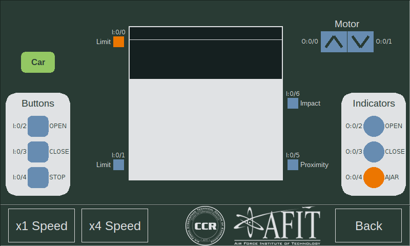
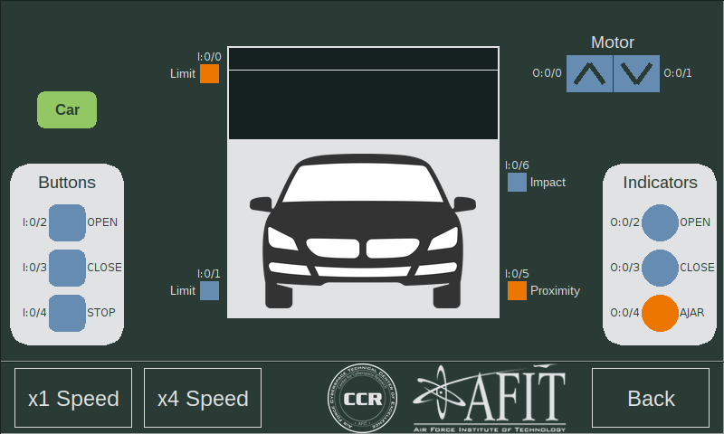
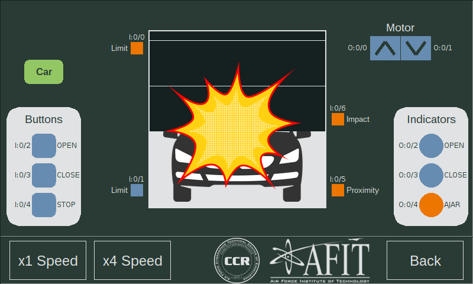
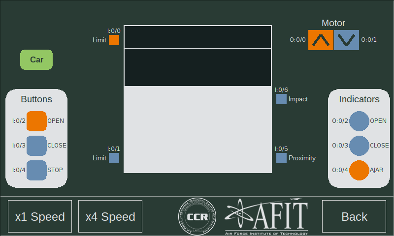
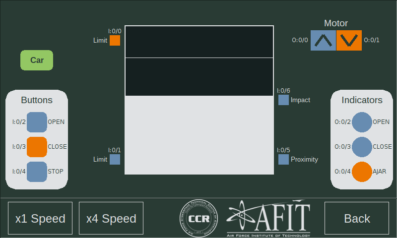
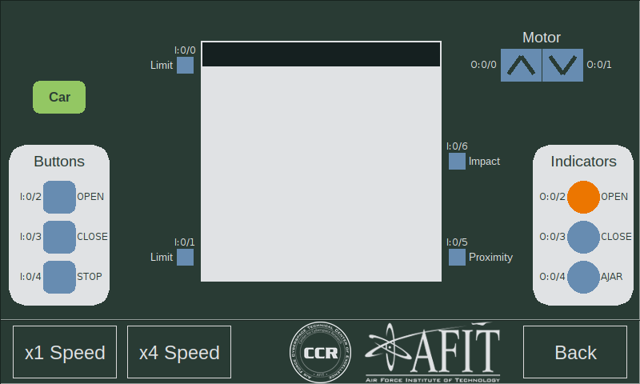
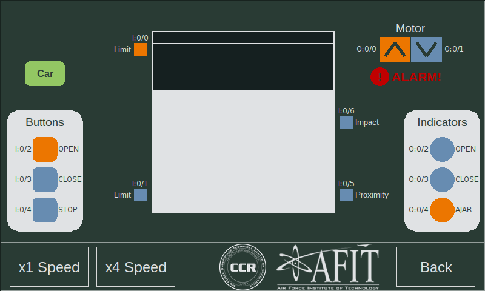

  

 
 

# Lab 2 - Door Control

# Intro

During this lab you will learn about programming PLCs using ladder logic. In order to demonstrate this, you will write a fully functioning door controller. All of the control in this lab is digital (i.e., no analog inputs or outputs used).

# Understanding the simulation

First, let's take a look at the door simulation to understand the individual components.

## Sensors:

* **Buttons:** the button panel allows the user to operate the door. Pressing one of the buttons on the touchscreen toggles the state of that button and the value is sent to the corresponding PLC digital input. The PLC must read these values and determine how to react. **Multiple buttons may be pressed at one time.**

* **Limits:** the limit switches are used to detect if the door is fully open, fully closed or somewhere in between (ajar). If the door is fully closed, Limit I:0/1 will be high (orange). If the door is fully open, Limit I:0/2 will be low (blue). **Note the inverted logic between these two - this was intentional.**

* **Proximity:** this sensor detects the presence of a car driving through the door.
* **Impact:** this sensor detects if the door impacts a car.

## Actuators:

* **Motor:** To simplify the control scheme, the door simulation uses two Relay Outputs from the PLC to control the Motor. O:0/0 tells the motor to move the door up, and O:0/1 tells the motor to move the door down.

* **Indicators:** There are three indicator lights controlled by the PLC via three Relay Outputs. 
	* "OPEN" (O:0/2) indicates that the door is fully open.
	* "CLOSE" (O:0/3) indicates that the door is fully closed.
	* "AJAR" (O:0/4) indicates that the door is neither fully open nor closed.

## Other:

* **Speed Control:** testing different ladder logic code can get tedious if the door takes too long to open or close. Pressing the "x4 Speed" button will speed up the simulation by a factor of 4. Pressing the "x1 Speed" button will return the simulation to normal time.

* **Car:** pressing the "Car" button will cause a simulated car to drive through the door. The car will remain present for 10 seconds and then disappear. Pressing the button multiple times will reset the 10 second timer allowing the car to stay longer.

* **Alarm:** the "ALARM!" warning will display momentarily if the motor is driven in both directions simultaneously or if the motor quickly reverses direction. 
	
	Note: if the simulation is running at 4x speed, it may be difficult to get the alarm to show the motor reversing directions.

# Instructions

1. **Make a copy of IO_Test.RSS** and use it as a baseline to get started on this project.

	**Warning! If you start with a blank project file, you must [configure the network settings](../docs/RSLogix_Net_Config.md) so that you do not remove your PLC's IP address assignment.**

1. Write a ladder logic program that fulfills the following criteria:

	1. The motor must never be driven both up and down at the same time.
	
	1. The PLC must activate the appropriate indicator for the current state of the system. Only one indicator should be active at a time.
	1. The “OPEN” and “CLOSE” buttons should work when they are activated.
	1. If the “OPEN” and “CLOSE” buttons are both active the door should stop.
	1. When the “STOP” button is pressed, the door should stop.
	1. When the door reaches a limit switch it should stop.
	1. When the “Proximity” sensor is triggered, the door should not be able to move down, but may continue to move up. This is to avoid crashing into a car.
	1. If the “Impact” sensor is triggered, the motor should stop completely.
	

1. If time permits, add logic to the program to enforce one final criteria. 

	- The motor must not reverse direction until it has come to a complete stop first. 

	Since no feedback is available, a timer may be used to delay 2 seconds before reversing direction. This should provide enough time for the door to stop fully.

	Note: See [this tutorial](https://www.youtube.com/watch?v=kONl5e9f6Qk) for an example of using timers in RSLogix 500:
	

  
[Return](./README.md)

