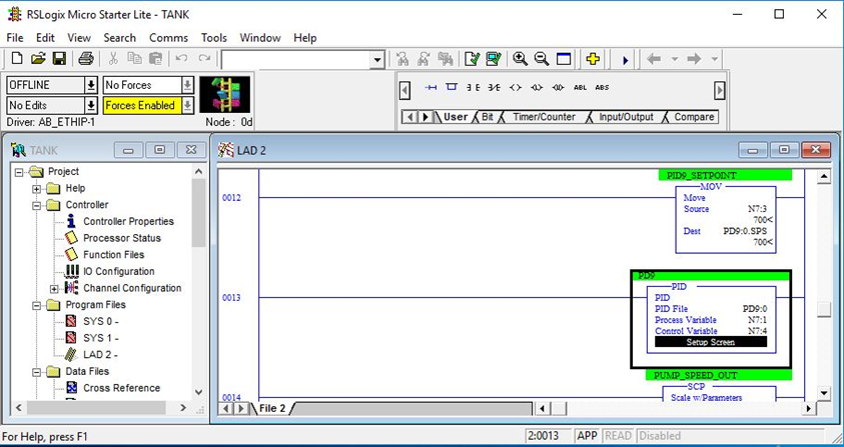
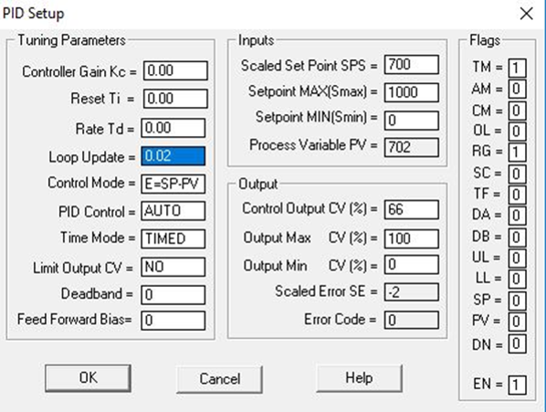
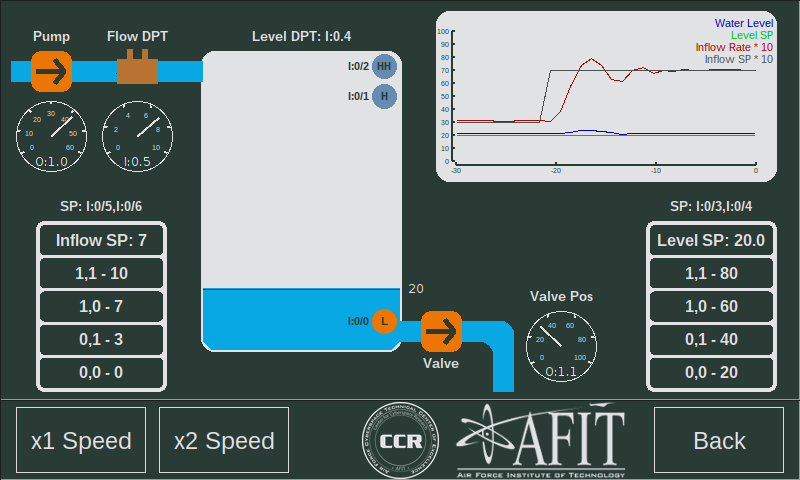

  

 
 

# Lab 3 - Fluid Tank Control

# Intro

During this lab you will learn about PID control and tuning. In order to demonstrate this, you will modify the existing Tank.RSS project file to tune the PID for controlling the fluid inflow into the tank.

# PID Control

PID controllers are extremely common tools for controlling analog physical processes. For example, quad-copters use 3 or more PIDs to vary the speed of the 4 propellers to achieve specific yaw, pitch and roll values and stay in the air. 

PID stands for “proportional–integral–derivative” and has three primary tuning parameters: P, I and D. 

Read the summary and fundamental operation of PID controllers [here](https://en.wikipedia.org/wiki/PID_controller) to get a general idea of how they work.

**PIDs function by measuring a “Process Variable” (PV), calculating error based on a “Setpoint” (SP) and using the error and PID tuning parameters to calculate a “Control Variable” (CV).**

The fluid tank uses two PID controllers:
* Inflow rate PID - PD9:
	* PV - Inflow rate
	* CV - Pump speed
* Fluid level PID - PD10:
	* PV - Fluid level
	* CV - Valve position

# Understanding the simulation

In this lab, you will use the Fluid Tank simulation to experiment with PIDs. 

## Actuators

This simulation uses two actuators. Each actuator has an analog output to determine the position/speed and a digital output to enable/disable the actuator. If the actuator is disabled it will return to 0.

* Pump
	* Enable - Digital output 0 - O:0/0
	* CV - Analog output 0 - O:1.0
		* Min - 0V (0) - pump idle
		* Max - 10V (32767) - 10% of the tank level per second
* Valve
	* Enable - Digital output 1 - O:0/1
	* CV - Analog output 1 - O:1.1
		* Min - 0V (0) - 10% of the tank level per second
		* Max - 10V (32767) - valve closed

## Sensors

This simulation has two analog sensors and three digital sensors. The two analog sensors represent differential pressure transmitters (DPTs).

* Flow DPT
	* Analog input 1 - I:0/5
	* Min - 0v (0) - 0 flow
	* Max - 10V (1023) - 10% of the tank level per second
* Fluid level DPT
	* Analog input 0 - I:0/4
	* Min - 0v (0) - tank empty
	* Max - 10V (1023) - tank full 
* Float sensors (not used in lab)
	* Low - I:0/0 - threshold 10%
	* High - I:0/1 - threshold 85%
	* High-high - I:0/2 - threshold 95%

## Other

### **Setpoint selection**

This simulation was designed to work without the presence of an HMI. Typically, an HMI would be used to select setpoints for the process. Instead, the simulation uses digital inputs of the PLC to send setpoints. The PLC must interpret these values.
	
The Inflow SP button panel uses two of the PLC's digital inputs to send the desired inflow rate to the PLC.

| Inflow Setpoint | I:0/5 | I:0/6 |
|:--------:|:-----:|:-----:|
|     0    |   0   |   0   |
|     3    |   0   |   1   |
|     7    |   1   |   0   |
|    10    |   1   |   1   |

The Level SP button panel uses two of the PLC's digital inputs to send the desired fluid level to the PLC.

| Level Setpoint | I:0/3 | I:0/4 |
|:--------:|:-----:|:-----:|
|    20    |   0   |   0   |
|    40    |   0   |   1   |
|    60    |   1   |   0   |
|    80    |   1   |   1   |

### **Graph**

To assist the PID tuning process, the simulation includes a plot of the relevant data. Touching/clicking on the graph will enlarge it. Touching it again will return it to normal size. The graph is implemented as a widget in the src/widgets/ directory for use in other apps.

### **Speed selection**

You can speed up the simulation by clicking the "x2 Speed" button. **Warning: speeding up the simulation will change the required PID tuning parameters.**

# Instructions

## Getting Started

1. Open the Tank project file in RSLogix.

2. Find the PID block for PD9:0.

3. Open the PID “Setup Screen” and verify that it looks like this. All of the values under Tuning Parameters and most of the Flags should be the same. Under "Inputs" and "Outputs" SPS, PV and CV may be different, but the max and min values should be the same.

## Tuning:

1. PID tuning is the process of selecting the three tuning parameters to achieve optimal results. PID tuning is 1% science, 9% art and 90% random guessing.

2. You will tune PID9 to accurately control the pump to achieve a specific inflow rate.

3. Each time you change the tuning parameters, change the "Inflow SP" to 3, wait for it to stabilize, and then change it to 7. Pay attention to how the Inflow Rate responds to the Inflow SP with different tuning parameters.

4. **Start by increasing P while keeping I and D at 0.0. Notice how the process responds to SP changes.**

5. **Next, add I. In this program, the smaller the I-value, the larger the impact. Start with an I of 0.10 and decrease it to see the impact.**

6. **Lastly, add in some D to reduce the overshoot. Note how the system reacts when you have too much D vs too little D. Also note how CV behaves as you change D.**

  
[Return](./README.md)

